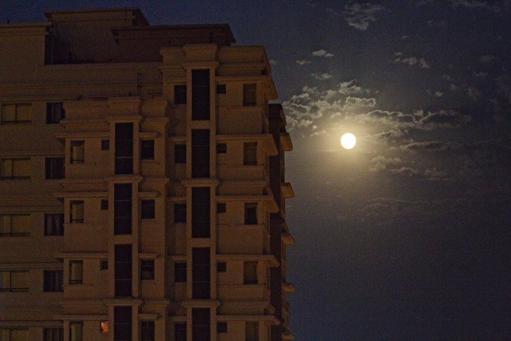

The members of Students’ Gymkhana are the student body representatives of NISER. It works to strengthen the voice of NISERites in all forums and coordinate action for the health, harmony and needs of all students.

The Students Gymkhana along with its infrastructure is an organization to meet the following objectives:

• To foster and develop all student activities in the institute.

• To promote and develop organizational abilities in students.

• To identify student issues and promote discussion to address them.

• To develop a well-informed, articulate, and participative student community life, and to increase social awareness.

• To function as the office for all election/nominations of students for Gymkhana activities.

• To facilitate administrative and official support for all recognized student activities.

. To provide the best possible level of health and amenities available to the students.

The Gymkhana is composed of 5 members:

President, [Ashish Shukla, SCS Int-MSc. 5th year]

Campus Secretary, [Photo, Chandranathan A, SPS Int-MSc. 5th year]

General Secretary, Cultural Affairs, [Tanya Pattnaik, SBS Int-MSc. 5th-year]

Sports Secretary, [Balabhadra Pradhan, SBS Int-MSc. 5th-year]

Treasurer. [Photo, Arnav Paul, SCS Int-MSc. 5th-year]

The members of Gymkhana are elected annually by an election conducted fairly under the eyes of Dean, SA.

Email Id: studentsgymkhana@niser.ac.in

Students Gymkhana Office is in SAC room no. 1

More details about the Students Gymkhana can be found here [[pdf attached(Constitution)]](https://drive.google.com/file/d/16T4KstMaYQt13YEscuEmjpZ12LotAxZX/view?usp=drivesdk).